## Boosting


```python
import pandas as pd
import numpy as np
import matplotlib.pyplot as plt

```


```python
X = np.linspace(0, 20, 201)
plt.plot(X,np.sin(X))
y = np.sin(X)
```


```python
from sklearn import tree
dt = tree.DecisionTreeRegressor(max_depth=1)
```


```python
dt.fit(X.reshape(-1, 1),y)
```


    DecisionTreeRegressor(criterion='mse', max_depth=1, max_features=None,
               max_leaf_nodes=None, min_impurity_decrease=0.0,
               min_impurity_split=None, min_samples_leaf=1,
               min_samples_split=2, min_weight_fraction_leaf=0.0,
               presort=False, random_state=None, splitter='best')


### Step 1 

Here, all we are doing is using an average of our values as a model of our data. Note that the "actual function" of our data is a sin curve. We are going to try and approximate that by way of boosting and a decision tree regressor!


```python
plt.plot(X,np.sin(X))
f0 = np.sin(X).mean()
plt.hlines(f0,0,20)
```


    <matplotlib.collections.LineCollection at 0x10f824e10>


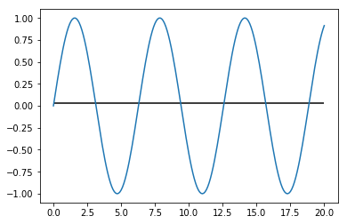


##### OK, so we have our extremely basic, extremely inaccurate model. Let's go ahead and build off of that


```python

e0 = np.sin(X) - f0
e0
```


    array([-0.03169512,  0.0681383 ,  0.16697421,  0.26382509,  0.35772323,
            0.44773042,  0.53294736,  0.61252257,  0.68566097,  0.75163179,
            0.80977587,  0.85951224,  0.90034397,  0.93186307,  0.95375461,
            0.96579987,  0.96787849,  0.95996969,  0.94215251,  0.91460497,
            0.87760231,  0.83151425,  0.77680129,  0.7140101 ,  0.64376806,
            0.56677703,  0.48380625,  0.39568476,  0.30329303,  0.20755421,
            0.10942489,  0.00988555, -0.09006926, -0.18944081, -0.28723622,
           -0.38247834, -0.47421556, -0.56153126, -0.64355301, -0.71946128,
           -0.78849761, -0.84997223, -0.90327089, -0.94786105, -0.98329719,
           -1.00922523, -1.02538612, -1.03161837, -1.02785973, -1.01414773,
           -0.99061939, -0.9575098 , -0.91514977, -0.86396256, -0.8044596 ,
           -0.73723544, -0.66296175, -0.58238066, -0.4962973 , -0.40557178,
           -0.31111062, -0.21385762, -0.11478452, -0.01488122,  0.08485409,
            0.18342487,  0.27984625,  0.3731548 ,  0.46241823,  0.54674465,
            0.62529148,  0.69727392,  0.76197275,  0.8187415 ,  0.86701298,
            0.90630486,  0.93622455,  0.95647312,  0.96684823,  0.96724622,
            0.95766313,  0.93819469,  0.90903544,  0.87047672,  0.82290379,
            0.766792  ,  0.70270198,  0.63127411,  0.55322208,  0.46932574,
            0.38042337,  0.28740325,  0.1911948 ,  0.09275931, -0.00691969,
           -0.10684624, -0.2060219 , -0.30345574, -0.39817425, -0.48923101,
           -0.57571623, -0.65676577, -0.7315698 , -0.79938093, -0.85952159,
           -0.91139088, -0.95447054, -0.98833013, -1.01263135, -1.02713137,
           -1.03168532, -1.02624771, -1.01087285, -0.98571437, -0.95102364,
           -0.90714729, -0.85452371, -0.7936787 , -0.7252202 , -0.64983223,
           -0.56826804, -0.48134258, -0.3899244 , -0.29492691, -0.19729929,
           -0.09801701,  0.00192793,  0.10153692,  0.19981471,  0.29577932,
            0.38847192,  0.47696635,  0.5603784 ,  0.63787465,  0.70868077,
            0.77208931,  0.8274667 ,  0.87425963,  0.91200055,  0.94031238,
            0.95891224,  0.96761427,  0.96633154,  0.95507685,  0.93396266,
            0.90319994,  0.86309606,  0.81405171,  0.75655695,  0.69118623,
            0.61859272,  0.53950175,  0.45470357,  0.36504546,  0.27142324,
            0.17477236,  0.07605854, -0.02373193, -0.12360197, -0.2225537 ,
           -0.31959843, -0.41376653, -0.5041171 , -0.58974739, -0.6698018 ,
           -0.74348046, -0.8100472 , -0.8688369 , -0.91926215, -0.96081913,
           -0.99309261, -1.01576012, -1.02859518, -1.03146955, -1.0243545 ,
           -1.00732112, -0.98053962, -0.94427757, -0.8988973 , -0.84485223,
           -0.78268236, -0.71300888, -0.63652794, -0.55400371, -0.46626074,
           -0.37417574, -0.27866878, -0.18069414, -0.08123076,  0.01872757,
            0.11818209,  0.21613909,  0.31161981,  0.40367024,  0.49137065,
            0.57384475,  0.6502685 ,  0.7198783 ,  0.78197862,  0.83594898,
            0.88125013])


```python
##plotting residuals
plt.plot(X,e0)
```


    [<matplotlib.lines.Line2D at 0x1a1d015748>]


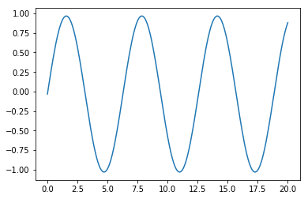


### Step 2: fitting a "stump" to the residuals


```python
f1 = tree.DecisionTreeRegressor(max_depth=1)

f1.fit(X.reshape(-1, 1),e0)
ensemble_preds_1 = f1.predict(X.reshape(-1, 1)) + f0

plt.plot(X,np.sin(X))
plt.plot(X,ensemble_preds_1)

```


    [<matplotlib.lines.Line2D at 0x1a1cf33128>]


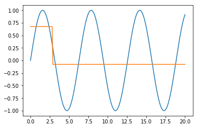


### Step 3: fitting another "stump" to the residuals of the previous model


```python
e1 = np.sin(X) - (f0 + f1.predict(X.reshape(-1, 1)))
```


```python
data = X.reshape(-1, 1)
f2 = tree.DecisionTreeRegressor(max_depth=1)
f2.fit(X.reshape(-1, 1),e1)
plt.plot(X,e1)
ensemble_preds_2 = f1.predict(data) + f2.predict(data) + f0
plt.plot(X, ensemble_preds_2)
plt.title('fitting to residuals (y - (f0(x) + f1(x)))')
```


    Text(0.5,1,'fitting to residuals (y - (f0(x) + f1(x)))')


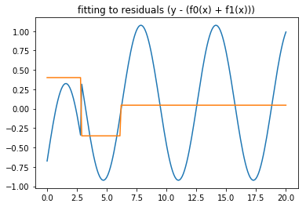


```python
plt.plot(X,np.sin(X))
plt.plot(X, ensemble_preds_2)
plt.title('Model v. our "data"')
```


    Text(0.5,1,'Model v. our "data"')


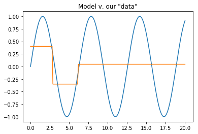


### Fitting yet another "stump"


```python
e2 = np.sin(X) - (f2.predict(data) + f1.predict(data) + f0)
f3 = tree.DecisionTreeRegressor(max_depth=1)
f3.fit(X.reshape(-1, 1),e2)
plt.plot(X,e2)
ensemble_preds_3 = f3.predict(data) + f2.predict(data) + f1.predict(data) + f0
plt.plot(X,ensemble_preds_3)
plt.title('fitting to residuals (y - (f0(x) + f1(x) + f2(x)))')
```


    Text(0.5,1,'fitting to residuals (y - (f0(x) + f1(x) + f2(x)))')


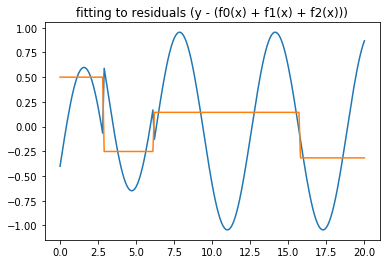


```python
plt.plot(X,np.sin(X))
plt.plot(X,ensemble_preds_3)
plt.title('Model v. our "data"')
```


    Text(0.5,1,'Model v. our "data"')


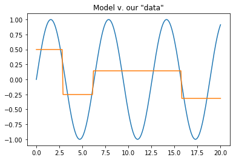


### another one


```python
e3 = np.sin(X) - (f3.predict(data) + f2.predict(data) + f1.predict(data) + f0)
f4 = tree.DecisionTreeRegressor(max_depth=1)
f4.fit(data,e3)
plt.plot(X,e3)
ensemble_preds_4 = f4.predict(data) + f3.predict(data) + f2.predict(data) + f1.predict(data) + f0
plt.plot(X,ensemble_preds_4)
```


    [<matplotlib.lines.Line2D at 0x1a2521b550>]


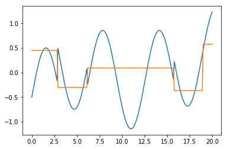


```python
plt.plot(X,np.sin(X))
plt.plot(X,ensemble_preds_4)
```


    [<matplotlib.lines.Line2D at 0x1a252cc5c0>]


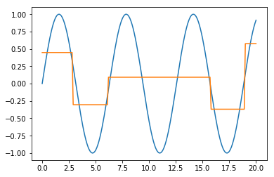


### and another


```python
e4 = np.sin(X) - (f4.predict(data) + f3.predict(data) + f2.predict(data) + f1.predict(data) + f0)
f5 = tree.DecisionTreeRegressor(max_depth=1)
f5.fit(data,e4)
plt.plot(X,e4)
ensemble_preds_5 = f5.predict(data) + f4.predict(data) + f3.predict(data) + f2.predict(data) + f1.predict(data) + f0
plt.plot(X,ensemble_preds_5)
```


    [<matplotlib.lines.Line2D at 0x1a25473ac8>]


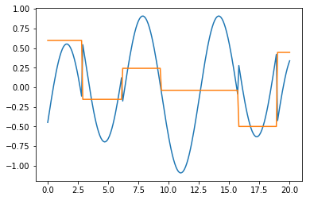


```python
plt.plot(X,np.sin(X))
plt.plot(X,ensemble_preds_5)
```


    [<matplotlib.lines.Line2D at 0x1a25460a20>]


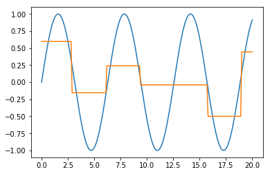


```python
def simple_boosting_algorithm(X,y,n_learners,learner,learning_rate,show_each_step = True):
    """Performs a simple ensemble boosting model 
    params: show_each_step - if True, will show with each additional learner"""
    f0 = y.mean()
    residuals = y - f0
    ensemble_predictions = np.full(len(y),fill_value=f0)
    plt.figure(figsize=(20,10))
    for i in range(n_learners):
        residuals = y - ensemble_predictions
        f = learner.fit(X.reshape(-1,1),residuals)
        ensemble_predictions = learning_rate * f.predict(X.reshape(-1,1)) + ensemble_predictions
        if show_each_step:
            plt.plot(X,y)
            plt.plot(X,ensemble_predictions)
            
    plt.plot(X,y)
    plt.plot(X,ensemble_predictions)
            
    plt.title('With ' + str(n_learners) + ' learners with a depth of '+ str(learner.max_depth) + ' and a learning rate of '+ str(learning_rate))
    
   
```


```python
simple_boosting_algorithm(X,np.sin(X),1,tree.DecisionTreeRegressor(max_depth=1),0.001,False)
```


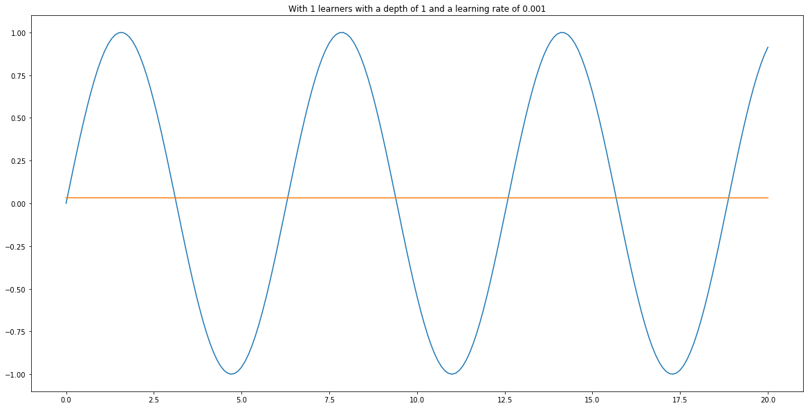


```python
simple_boosting_algorithm(X,np.sin(X),10000,tree.DecisionTreeRegressor(max_depth=1),0.01,False)
```


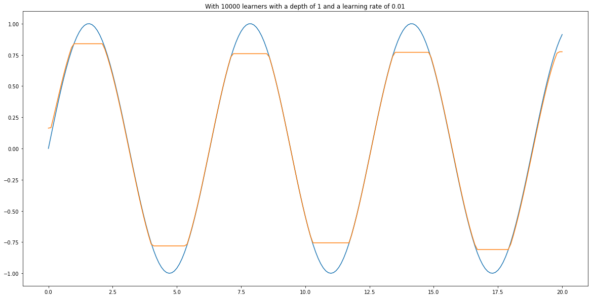


```python
simple_boosting_algorithm(X,np.sin(X),100,tree.DecisionTreeRegressor(max_depth=1),0.001,False)
```


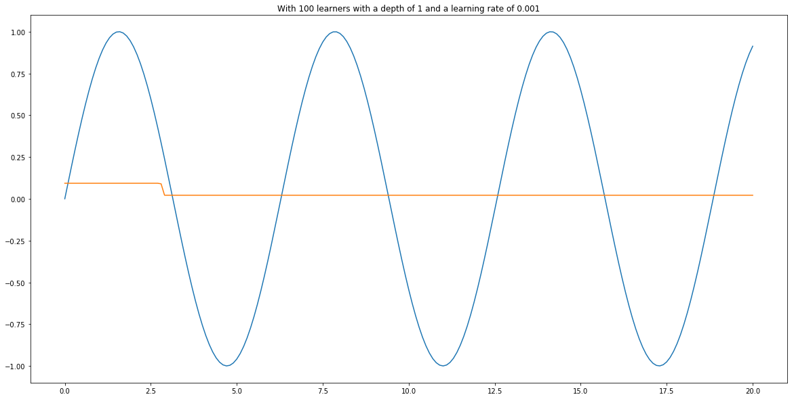


```python
simple_boosting_algorithm(X,np.sin(X),100000,tree.DecisionTreeRegressor(max_depth=1),0.01,False)
```


```python
simple_boosting_algorithm(X,np.sin(X),10000,tree.DecisionTreeRegressor(max_depth=1),0.01)
```


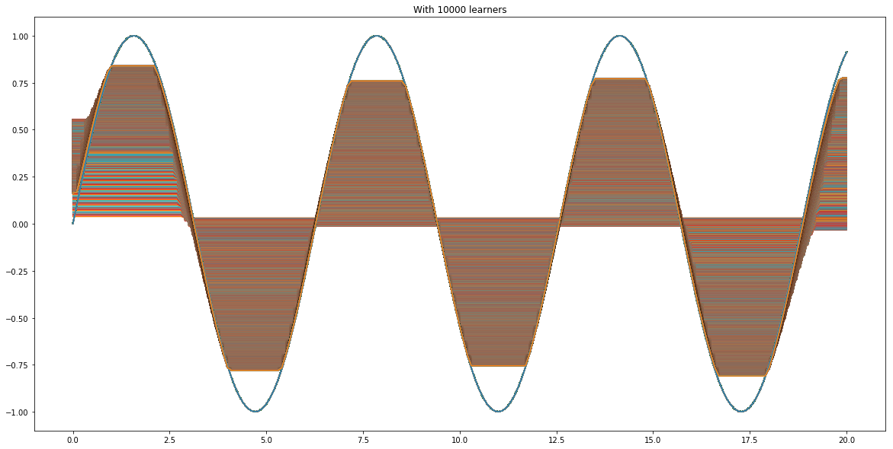


```python
simple_boosting_algorithm(X,np.sin(X),20,tree.DecisionTreeRegressor(max_depth=1),0.001)
```


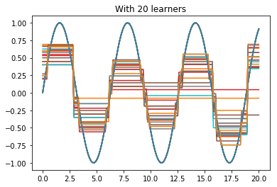


```python
simple_boosting_algorithm(X,np.sin(X),60,tree.DecisionTreeRegressor(max_depth=1),0.001)
```


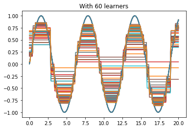


```python
simple_boosting_algorithm(X,np.sin(X),80,tree.DecisionTreeRegressor(max_depth=1),0.001)
```


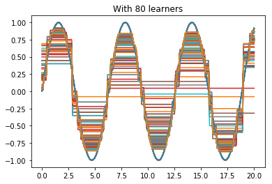


```python
simple_boosting_algorithm(X,np.sin(X),200,tree.DecisionTreeRegressor(max_depth=1),0.001)
```


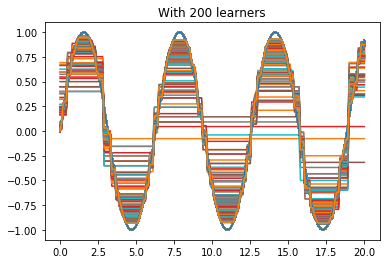

