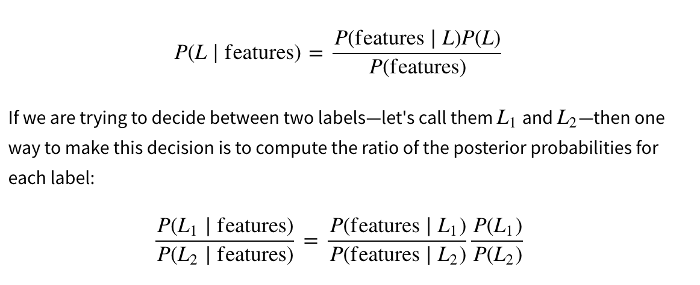
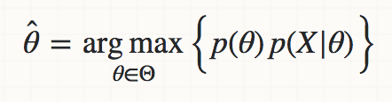
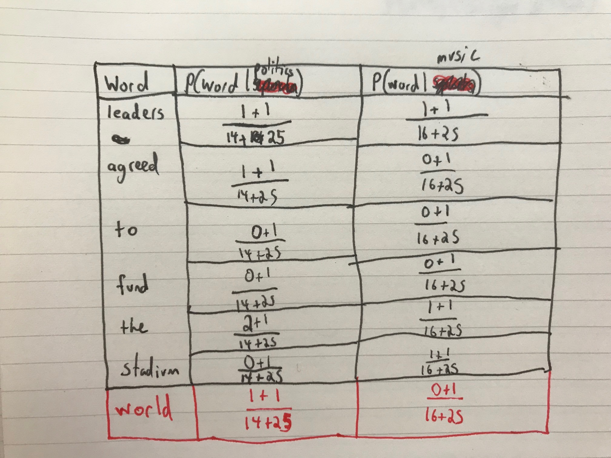
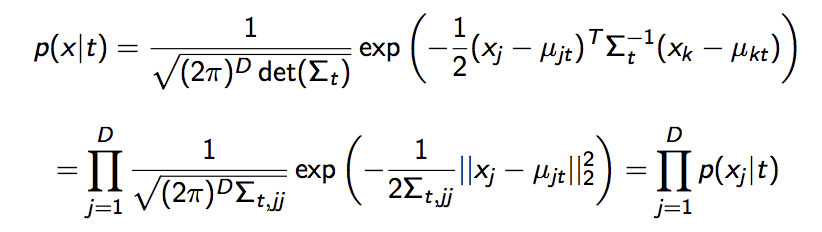

## Naive Bayes Classification

Suppose we are using an API to gather articles from a news website and grabbing phrases from two different types of articles:  music and politics.

We have a problem though! Only some of our articles have their category (music or politics). Is there a way we can use Machine Learning to help us label our data quickly?

-------------------------------
### Here are our articles
#### Music Articles:

* 'the song was popular'
* 'band leaders disagreed on sound'
* 'played for a sold out arena stadium'

#### Politics Articles

* 'world leaders met lask week'
* 'the election was close'
* 'the officials agreed on a compromise'
--------------------------------------------------------
Let's try and predict one example phrase:


* "world leaders agreed to fund the stadium"

How can we make a model that labels this for us rather than having to go through by hand?


```python
from collections import defaultdict
import numpy as np
music = ['the song was popular',
         'band leaders disagreed on sound',
         'played for a sold out arena stadium']

politics = ['world leaders met lask week',
            'the election was close',
            'the officials agreed on a compromise']

test_statement = 'world leaders agreed to fund the stadium'
```


```python
#labels : 'music' 'politics'
#features: words
test_statement_2 = 'officials met at the arena'
```


### Another way of looking at it


## So, in the context of our problem......


#### $ P(politics | phrase) = \frac{P(phrase|politics)P(politics)}{P(phrase)}$

#### $ P(politics) = \frac{ \# politics}{\# all\ articles} $

*where phrase is our test statement*

Estimating the parameters of our model (using Maximum a Posteriori):



### How should we calculate P(politics)?

This is essentially the distribution of the probability of either type of article. We have three of each type of article, therefore, we assume that there is an equal probability of either article


```python
p_politics = len(politics)/(len(politics) + len(music))
```


```python
p_politics
```


    0.5


```python
p_music = len(music)/(len(politics) + len(music))
```


```python
p_music
```


    0.5


### How do you think we should calculate: $ P(phrase | politics) $ ?


```python
# we need to break the phrases down into individual words


```

## $ P(phrase | politics) = \prod_{i=1}^{d} P(word_{i} | politics) $

### We need to make a *Naive* assumption.


```python
# assuming independence for each word


```

### $ P(word_{i} | politics) = \frac{\#\ of\ word_{i}\ in\ politics\ art.} {\#\ of\ total\ words\ in\ politics\ art.} $

### Can you foresee any issues with this?


```python
# we can't have a probability of 0


```

## $ P(word_{i} | politics) = \frac{\#\ of\ word_{i}\ in\ politics\ art. + \alpha} {\#\ of\ total\ words\ in\ politics\ art. + \alpha d} $

This correction process is called Laplace smoothing:
* d : number of features (in this instance total number of vocabulary words)
* $\alpha$ can be any number greater than 0 (it is usually 1)


#### Now let's find this calculation




```python
def vocab_maker(category):
    """returns the vocabulary for a given type of article"""
    vocab_category = set()
    for art in category:
        words = art.split()
        for word in words:
            vocab_category.add(word)
    return vocab_category
        
voc_music = vocab_maker(music)
voc_pol = vocab_maker(politics)
total_vocabulary = voc_music.union(voc_pol)

```


```python
voc_music
```


    {'a',
     'arena',
     'band',
     'disagreed',
     'for',
     'leaders',
     'on',
     'out',
     'played',
     'popular',
     'sold',
     'song',
     'sound',
     'stadium',
     'the',
     'was'}


```python
voc_pol
```


    {'a',
     'agreed',
     'close',
     'compromise',
     'election',
     'lask',
     'leaders',
     'met',
     'officials',
     'on',
     'the',
     'was',
     'week',
     'world'}


```python
voc_all = voc_music.union(voc_pol)
```


```python
voc_all
```


    {'a',
     'agreed',
     'arena',
     'band',
     'close',
     'compromise',
     'disagreed',
     'election',
     'for',
     'lask',
     'leaders',
     'met',
     'officials',
     'on',
     'out',
     'played',
     'popular',
     'sold',
     'song',
     'sound',
     'stadium',
     'the',
     'was',
     'week',
     'world'}


```python
total_vocab_count = len(voc_all)
total_music_count = len(voc_music)
total_politics_count = len(voc_pol)
```


```python
#P(politics | leaders agreed to fund the stadium)
```


```python
def find_number_words_in_category(phrase,category):
    statement = phrase.split()
    str_category=' '.join(category)
    cat_word_list = str_category.split()
    word_count = defaultdict(int)
    for word in statement:
        for art_word in cat_word_list:
            if word == art_word:
                word_count[word] +=1
            else:
                word_count[word]
    return word_count
                
            
```


```python
test_music_word_count = find_number_words_in_category(test_statement,music)

```


```python
test_music_word_count
```


    defaultdict(int,
                {'world': 0,
                 'leaders': 1,
                 'agreed': 0,
                 'to': 0,
                 'fund': 0,
                 'the': 1,
                 'stadium': 1})


```python
test_politic_word_count = find_number_words_in_category(test_statement,politics)
```


```python
test_politic_word_count
```


    defaultdict(int,
                {'world': 1,
                 'leaders': 1,
                 'agreed': 1,
                 'to': 0,
                 'fund': 0,
                 'the': 2,
                 'stadium': 0})


```python
def find_likelihood(category_count,test_category_count,alpha):
    num = np.product(np.array(list(test_category_count.values())) + alpha)
    denom = (category_count + total_vocab_count*alpha)**(len(test_category_count))
    
    return num/denom
```


```python
likelihood_m = find_likelihood(total_music_count,test_music_word_count,1)
```


```python
likelihood_p = find_likelihood(total_politics_count,test_politic_word_count,1)
```

### $ P(politics | article) = P(politics) x \prod_{i=1}^{d} P(word_{i} | politics) $

Deteriming the winner of our model:


```python
likelihood_not/(likelihood_not +likelihood_attending)
```


    0.17457886676875956


```python
likelihood_p * p_politics  > likelihood_m * p_music
```


    True


```python
likelihood_p /(likelihood_m +likelihood_p)
```


    0.8097960075442886


```python
likelihood_m /(likelihood_m +likelihood_p)
```


    0.19020399245571137


```python
likelihood_m * 0.5
```


    2.053870202840378e-11


Many times, the probabilities we end up are exceedingly small, so we can transform them using logs to save on computation speed

### $ log(P(politics | article)) = log(P(politics)) + \sum_{i=1}^{d}log( P(word_{i} | politics)) $


### Different Types of Naive Bayes Classifiers

Multinomial Naive Bayes Classifier: this is the example we just did! It is essentially a collection of a Bernoulli Naive Bayes Classifier. This classifer cannot handle negative values!


The Bernoulli Naive Bayes Classifier: used when your features are binary (0 or 1). In the context of a text based classification task, this would be whether or not a word appears in a document at all and calculating the probability of it occuring.


There is also the Gaussian Naive Bayes Classifier, which assumes that the features that you are predicting based off of are normally distributed.



### Pros:

* It is an efficient way to predict class of test data set. It perform well in multi class prediction
* When assumption of independence holds, a Naive Bayes classifier performs requires less training data and can perform better than models like logistic regression.
* Performs better with categorical inputs. For numerical input, one has to assume a normal distribution.

### Cons:

* On the other side naive Bayes is also known as a bad estimator, so the probability outputs from predict_proba are not to be taken too seriously.
* We are assuming of independent predictors, but in real life, it is almost impossible that we get a set of predictors which are completely independent. (amazingly, still works a lot of the time though!)

### Using Naive Bayes in sklearn


```python
from sklearn.naive_bayes import GaussianNB, BernoulliNB, MultinomialNB

model = GaussianNB()
model.fit(X_train,y_train)
model.predict(X_test)
```


    ---------------------------------------------------------------------------

    NameError                                 Traceback (most recent call last)

    <ipython-input-54-cded6637d7bd> in <module>()
          2 y_train = [1,0,0,0,1,1,1,1,1]
          3 model = GaussianNB()
    ----> 4 model.fit(X_train,y_train)
          5 model.predict(X_test)


    NameError: name 'X_train' is not defined

