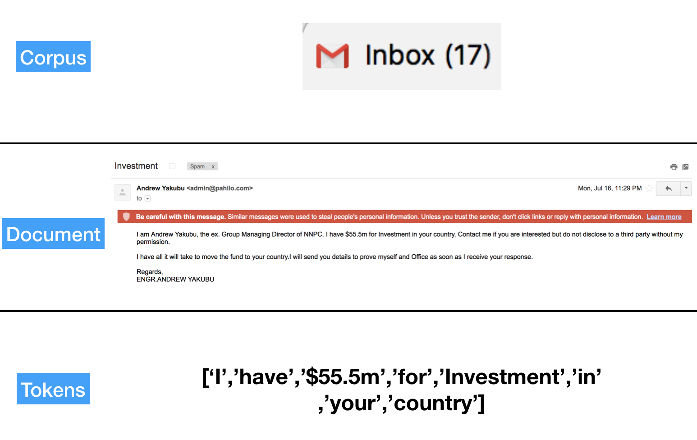

## There are a few different NLP libraries with python, uncomment the code below to install them


```python
# ! pip install spacy
# ! python -m spacy download en
# import nltk
# nltk.download('punkt') ##this downloads the default word tokenizer
# nltk.download('stopwords') ##this downloads all stopwords
# nltk.download('popular') ##this downloads many different popular libraries 
```

# Outline
### 1. Tokenization (stop words, stemming, lemmatizing)
### 2. Vectorization
### 3. NLP with Machine Learning
### 4. Cosine Similarity
### Bonus: Spacy

### 1. Tokenization
### Key terminology:

When we are performing NLP analysis, our entire collection of text is referred to as a **corpus**. Every item within a corpus is referred to as a **document**. Within that document, we break down the text into individual **tokens**, which can be either sentences or words. 

In the context of a spam classification problem, your entire inbox would be the corpus, each email would be a document, and each word/sentence would be a token.




```python
from nltk import sent_tokenize
test_text = """This is my first sentence. This is my second sentence. Oh wow now there is a third\
 sentence. This is getting out of control!"""
sent_tokenize(test_text)
```


    ['This is my first sentence.',
     'This is my second sentence.',
     'Oh wow now there is a third sentence.',
     'This is getting out of control!']


```python
##now let's tokenize by word
from nltk import word_tokenize
```


```python
word_tokenize(test_text)
```


    ['This',
     'is',
     'my',
     'first',
     'sentence',
     '.',
     'This',
     'is',
     'my',
     'second',
     'sentence',
     '.',
     'Oh',
     'wow',
     'now',
     'there',
     'is',
     'a',
     'third',
     'sentence',
     '.',
     'This',
     'is',
     'getting',
     'out',
     'of',
     'control',
     '!']


We have capitalization, punctuation and words that are all too frequent, such as "a", "the", "two". Let's create a tokenize function that will remove punctuation as well as commonly used words. NLTK has a stopwords method built-in. 


```python
from nltk.corpus import stopwords
print(stopwords.words('english')[:20])
```

    ['i', 'me', 'my', 'myself', 'we', 'our', 'ours', 'ourselves', 'you', "you're", "you've", "you'll", "you'd", 'your', 'yours', 'yourself', 'yourselves', 'he', 'him', 'his']


```python
import string
my_stopwords = set(stopwords.words('english'))

def tokenize(document):
    tocs = word_tokenize(document.lower())
    stop_words = set(stopwords.words('english'))
    tokenized_list = [toc for toc in tocs if toc not in stop_words]
    
    punctuation = set(string.punctuation)
    no_punctuation = [word for word in tokenized_list if word not in punctuation]
    
   
    
    return no_punctuation
    
    
```


```python
tokenize(test_text)
```


    ['first',
     'sentence',
     'second',
     'sentence',
     'oh',
     'wow',
     'third',
     'sentence',
     'getting',
     'control']


NLTK has tokenizers that have different applications.


```python
from nltk import TweetTokenizer, WhitespaceTokenizer
twt = TweetTokenizer()
toks = twt.tokenize('OMG coding is #fun and #bigly cool, do you agree @professor_purple_pants?')
toks
```


    ['OMG',
     'coding',
     'is',
     '#fun',
     'and',
     '#bigly',
     'cool',
     ',',
     'do',
     'you',
     'agree',
     '@professor_purple_pants',
     '?']


### Stemming/ Lemmatization

* Stemming: reduces words by removing suffixes (often reduces to strings that are not real words)
* Lemmatization: reduces words to some root form that is still in the the English dictionary

Longer Explanation: https://nlp.stanford.edu/IR-book/html/htmledition/stemming-and-lemmatization-1.html

Your use of stemming/lemmatization will wholly depend on the context of the problem you're trying to solve. Let's take a look at how a sample sentence might be treated differently depending on our stemming technique:


```python
sample_sentence = """when data scientists are performing natural language processing analysis, they must take\
 different verb tenses and singular versus plural words into account."""
```


```python
from nltk.stem import LancasterStemmer, SnowballStemmer, WordNetLemmatizer 
def stem_words(document,stemmer):
    toks = nltk.word_tokenize(document)
    wrd_list = []
    for word in toks:
        wrd_list.append(stemmer.stem(word))
    return " ".join(wrd_list)
    
    
```


```python
snowball = nltk.stem.SnowballStemmer('english')
```


```python
stem_words(sample_sentence,snowball)
```


    'when data scientist are perform natur languag process analysi , they must take differ verb tens and singular versus plural word into account .'


```python
lancaster = LancasterStemmer()
stem_words(sample_sentence,lancaster)
```


    'when dat sci ar perform nat langu process analys , they must tak diff verb tens and singul vers plur word into account .'


```python
regex_stemmer = nltk.RegexpStemmer('ing$|s$|e$|able$', min=4)
stem_words(sample_sentence,regex_stemmer)
```


    'when data scientist are perform natural languag process analysi , they must tak different verb tense and singular versu plural word into account .'


```python
def lem_words(document,lemmer):
    toks = nltk.word_tokenize(document)
    wrd_list = []
    for word in toks:
        wrd_list.append(lemmer.lemmatize(word))
    return " ".join(wrd_list)
```


```python
lemmer = nltk.stem.WordNetLemmatizer()
lem_words(sample_sentence,lemmer)
```


    'when data scientist are performing natural language processing analysis , they must take different verb tense and singular versus plural word into account .'


### Machine Learning models aren't able to operate on text because text means nothing to mathematical functions! We need to convert our text to a numerical form. SciKit Learn has packages that enable you to vectorize your documents


### Bag of Words Vectorization (count vectorizer)


A Bag of Words model is simply a collection of the count of words in each document. The order of the words is not taken into account, and neither is the frequency of words in the overall corpus. Each document will have a vector of length = total # of unique features in the corpus.


```python
from sklearn.feature_extraction.text import CountVectorizer, TfidfVectorizer
```


```python
basic_example = ['The Data Scientist wants to train a machine to train machine learning models.']
bow_sample = CountVectorizer()
bow_sample.fit(basic_example)
```


    CountVectorizer(analyzer='word', binary=False, decode_error='strict',
            dtype=<class 'numpy.int64'>, encoding='utf-8', input='content',
            lowercase=True, max_df=1.0, max_features=None, min_df=1,
            ngram_range=(1, 1), preprocessor=None, stop_words=None,
            strip_accents=None, token_pattern='(?u)\\b\\w\\w+\\b',
            tokenizer=None, vocabulary=None)


```python
print(bow_sample.vocabulary_)
```

    {'the': 5, 'data': 0, 'scientist': 4, 'wants': 8, 'to': 6, 'train': 7, 'machine': 2, 'learning': 1, 'models': 3}


```python
print(bow_sample.get_feature_names())
```

    ['data', 'learning', 'machine', 'models', 'scientist', 'the', 'to', 'train', 'wants']


```python
vector = bow_sample.transform(basic_example)
print(type(vector))
print(vector)
text_data = pd.DataFrame(vector.toarray(),columns=bow_sample.get_feature_names())
text_data
```

    <class 'scipy.sparse.csr.csr_matrix'>
      (0, 0)	1
      (0, 1)	1
      (0, 2)	2
      (0, 3)	1
      (0, 4)	1
      (0, 5)	1
      (0, 6)	2
      (0, 7)	2
      (0, 8)	1


<div>
<style scoped>
    .dataframe tbody tr th:only-of-type {
        vertical-align: middle;
    }

    .dataframe tbody tr th {
        vertical-align: top;
    }

    .dataframe thead th {
        text-align: right;
    }
</style>
<table border="1" class="dataframe">
  <thead>
    <tr style="text-align: right;">
      <th></th>
      <th>data</th>
      <th>learning</th>
      <th>machine</th>
      <th>models</th>
      <th>scientist</th>
      <th>the</th>
      <th>to</th>
      <th>train</th>
      <th>wants</th>
    </tr>
  </thead>
  <tbody>
    <tr>
      <th>0</th>
      <td>1</td>
      <td>1</td>
      <td>2</td>
      <td>1</td>
      <td>1</td>
      <td>1</td>
      <td>2</td>
      <td>2</td>
      <td>1</td>
    </tr>
  </tbody>
</table>
</div>


```python
new_data.toarray()[0].shape
```


    (9,)


```python
# We can turn another document into a vector by using the transform method
new_text = ['the data scientist plotted the residual error of her model']
new_data = bow_sample.transform(new_text)
new_count = pd.DataFrame(new_data.toarray(),columns=bow_sample.get_feature_names())
new_count
```


<div>
<style scoped>
    .dataframe tbody tr th:only-of-type {
        vertical-align: middle;
    }

    .dataframe tbody tr th {
        vertical-align: top;
    }

    .dataframe thead th {
        text-align: right;
    }
</style>
<table border="1" class="dataframe">
  <thead>
    <tr style="text-align: right;">
      <th></th>
      <th>data</th>
      <th>learning</th>
      <th>machine</th>
      <th>models</th>
      <th>scientist</th>
      <th>the</th>
      <th>to</th>
      <th>train</th>
      <th>wants</th>
    </tr>
  </thead>
  <tbody>
    <tr>
      <th>0</th>
      <td>1</td>
      <td>0</td>
      <td>0</td>
      <td>0</td>
      <td>1</td>
      <td>2</td>
      <td>0</td>
      <td>0</td>
      <td>0</td>
    </tr>
  </tbody>
</table>
</div>


### N-grams

Often times, it might not be individual words, but rather how certain phrases that might allow us to draw the most insight. By altering the ngram_range, we are creating new feature for our model. Our vocabulary, however, will remain the same.


```python
sentences = ['The Data Scientist wants to train a machine to train machine learning models.',
'the data scientist plotted the residual error of her model in her analysis',
'Her analysis was so good, she won a Kaggle competition.',
'The machine gained sentiance']
## here we are instantiating a bag of words model with ngrams ranging from single word to two words.
bigrams = CountVectorizer(stop_words='english',ngram_range=(1,2))
bigram_vector = bigrams.fit_transform(sentences)
bigrams.get_feature_names()[:10]
```


    ['analysis',
     'analysis good',
     'competition',
     'data',
     'data scientist',
     'error',
     'error model',
     'gained',
     'gained sentiance',
     'good']


```python
bigram_df = pd.DataFrame(bigram_vector.toarray(),columns=bigrams.get_feature_names())
bigram_df.head()
```


<div>
<style scoped>
    .dataframe tbody tr th:only-of-type {
        vertical-align: middle;
    }

    .dataframe tbody tr th {
        vertical-align: top;
    }

    .dataframe thead th {
        text-align: right;
    }
</style>
<table border="1" class="dataframe">
  <thead>
    <tr style="text-align: right;">
      <th></th>
      <th>analysis</th>
      <th>analysis good</th>
      <th>competition</th>
      <th>data</th>
      <th>data scientist</th>
      <th>error</th>
      <th>error model</th>
      <th>gained</th>
      <th>gained sentiance</th>
      <th>good</th>
      <th>...</th>
      <th>scientist</th>
      <th>scientist plotted</th>
      <th>scientist wants</th>
      <th>sentiance</th>
      <th>train</th>
      <th>train machine</th>
      <th>wants</th>
      <th>wants train</th>
      <th>won</th>
      <th>won kaggle</th>
    </tr>
  </thead>
  <tbody>
    <tr>
      <th>0</th>
      <td>0</td>
      <td>0</td>
      <td>0</td>
      <td>1</td>
      <td>1</td>
      <td>0</td>
      <td>0</td>
      <td>0</td>
      <td>0</td>
      <td>0</td>
      <td>...</td>
      <td>1</td>
      <td>0</td>
      <td>1</td>
      <td>0</td>
      <td>2</td>
      <td>2</td>
      <td>1</td>
      <td>1</td>
      <td>0</td>
      <td>0</td>
    </tr>
    <tr>
      <th>1</th>
      <td>1</td>
      <td>0</td>
      <td>0</td>
      <td>1</td>
      <td>1</td>
      <td>1</td>
      <td>1</td>
      <td>0</td>
      <td>0</td>
      <td>0</td>
      <td>...</td>
      <td>1</td>
      <td>1</td>
      <td>0</td>
      <td>0</td>
      <td>0</td>
      <td>0</td>
      <td>0</td>
      <td>0</td>
      <td>0</td>
      <td>0</td>
    </tr>
    <tr>
      <th>2</th>
      <td>1</td>
      <td>1</td>
      <td>1</td>
      <td>0</td>
      <td>0</td>
      <td>0</td>
      <td>0</td>
      <td>0</td>
      <td>0</td>
      <td>1</td>
      <td>...</td>
      <td>0</td>
      <td>0</td>
      <td>0</td>
      <td>0</td>
      <td>0</td>
      <td>0</td>
      <td>0</td>
      <td>0</td>
      <td>1</td>
      <td>1</td>
    </tr>
    <tr>
      <th>3</th>
      <td>0</td>
      <td>0</td>
      <td>0</td>
      <td>0</td>
      <td>0</td>
      <td>0</td>
      <td>0</td>
      <td>1</td>
      <td>1</td>
      <td>0</td>
      <td>...</td>
      <td>0</td>
      <td>0</td>
      <td>0</td>
      <td>1</td>
      <td>0</td>
      <td>0</td>
      <td>0</td>
      <td>0</td>
      <td>0</td>
      <td>0</td>
    </tr>
  </tbody>
</table>
<p>4 rows × 36 columns</p>
</div>


## TF-IDF vectorizer

* The tf-idf vectorizer takes has the ability to detect words that might be more important for our specific corpus http://scikit-learn.org/stable/modules/feature_extraction.html


* Places a higher weight on words that appear in certain documents that are infrequent in the overall corpus


#### The more frequent a word comes up in different documents, the less weight it gets. This places more emphasis on words that are rarer in our domain and more specifically, the corpus we are training on


```python
sentences = ['The Data Scientist wants to train a machine to train machine learning models.',
'the data scientist plotted the residual error of her model in her analysis',
'Her analysis was so good, she won a Kaggle competition.',
'The machine gained sentiance']
tfidf = TfidfVectorizer(stop_words='english')
tfidf_sentences = tfidf.fit_transform(sentences)
```


```python
data = pd.DataFrame(tfidf_sentences.toarray(), columns = tfidf.get_feature_names())
```


```python
data.head()
```


<div>
<style scoped>
    .dataframe tbody tr th:only-of-type {
        vertical-align: middle;
    }

    .dataframe tbody tr th {
        vertical-align: top;
    }

    .dataframe thead th {
        text-align: right;
    }
</style>
<table border="1" class="dataframe">
  <thead>
    <tr style="text-align: right;">
      <th></th>
      <th>analysis</th>
      <th>competition</th>
      <th>data</th>
      <th>error</th>
      <th>gained</th>
      <th>good</th>
      <th>kaggle</th>
      <th>learning</th>
      <th>machine</th>
      <th>model</th>
      <th>models</th>
      <th>plotted</th>
      <th>residual</th>
      <th>scientist</th>
      <th>sentiance</th>
      <th>train</th>
      <th>wants</th>
      <th>won</th>
    </tr>
  </thead>
  <tbody>
    <tr>
      <th>0</th>
      <td>0.000000</td>
      <td>0.000000</td>
      <td>0.240692</td>
      <td>0.000000</td>
      <td>0.000000</td>
      <td>0.000000</td>
      <td>0.000000</td>
      <td>0.305288</td>
      <td>0.481384</td>
      <td>0.000000</td>
      <td>0.305288</td>
      <td>0.000000</td>
      <td>0.000000</td>
      <td>0.240692</td>
      <td>0.000000</td>
      <td>0.610575</td>
      <td>0.305288</td>
      <td>0.000000</td>
    </tr>
    <tr>
      <th>1</th>
      <td>0.325557</td>
      <td>0.000000</td>
      <td>0.325557</td>
      <td>0.412928</td>
      <td>0.000000</td>
      <td>0.000000</td>
      <td>0.000000</td>
      <td>0.000000</td>
      <td>0.000000</td>
      <td>0.412928</td>
      <td>0.000000</td>
      <td>0.412928</td>
      <td>0.412928</td>
      <td>0.325557</td>
      <td>0.000000</td>
      <td>0.000000</td>
      <td>0.000000</td>
      <td>0.000000</td>
    </tr>
    <tr>
      <th>2</th>
      <td>0.366739</td>
      <td>0.465162</td>
      <td>0.000000</td>
      <td>0.000000</td>
      <td>0.000000</td>
      <td>0.465162</td>
      <td>0.465162</td>
      <td>0.000000</td>
      <td>0.000000</td>
      <td>0.000000</td>
      <td>0.000000</td>
      <td>0.000000</td>
      <td>0.000000</td>
      <td>0.000000</td>
      <td>0.000000</td>
      <td>0.000000</td>
      <td>0.000000</td>
      <td>0.465162</td>
    </tr>
    <tr>
      <th>3</th>
      <td>0.000000</td>
      <td>0.000000</td>
      <td>0.000000</td>
      <td>0.000000</td>
      <td>0.617614</td>
      <td>0.000000</td>
      <td>0.000000</td>
      <td>0.000000</td>
      <td>0.486934</td>
      <td>0.000000</td>
      <td>0.000000</td>
      <td>0.000000</td>
      <td>0.000000</td>
      <td>0.000000</td>
      <td>0.617614</td>
      <td>0.000000</td>
      <td>0.000000</td>
      <td>0.000000</td>
    </tr>
  </tbody>
</table>
</div>


#### Our data is a sparse matrix, which is a matrix with far more 0 values than not 0 values

#### More about it herehttps://docs.scipy.org/doc/scipy/reference/sparse.html

#### To make better sense of it, we can put it back into a dataframe. 

#### Caution: moving from sparse matrix to array format will take much more memory to perform operations


```python
text_data = pd.DataFrame(training_data.toarray(),columns=bow.get_feature_names())
```

Now if we want to transform a new test document, we can use the transform method that we previously used


```python
X_test = bow.transform(['this is a test document','look at me I am a test document'])
```


```python
X_test
```

## Basic Machine Learning NLP Pipeline Example

Now that we've gone over the basics of NLP data, we can take a look at an example of how a pipeline might work.


```python
review_data = pd.read_json('./reviews_Musical_Instruments_5.json',lines=True)
```


```python
review_data.head()
```


<div>
<style scoped>
    .dataframe tbody tr th:only-of-type {
        vertical-align: middle;
    }

    .dataframe tbody tr th {
        vertical-align: top;
    }

    .dataframe thead th {
        text-align: right;
    }
</style>
<table border="1" class="dataframe">
  <thead>
    <tr style="text-align: right;">
      <th></th>
      <th>asin</th>
      <th>helpful</th>
      <th>overall</th>
      <th>reviewText</th>
      <th>reviewTime</th>
      <th>reviewerID</th>
      <th>reviewerName</th>
      <th>summary</th>
      <th>unixReviewTime</th>
    </tr>
  </thead>
  <tbody>
    <tr>
      <th>0</th>
      <td>1384719342</td>
      <td>[0, 0]</td>
      <td>5</td>
      <td>Not much to write about here, but it does exac...</td>
      <td>02 28, 2014</td>
      <td>A2IBPI20UZIR0U</td>
      <td>cassandra tu "Yeah, well, that's just like, u...</td>
      <td>good</td>
      <td>1393545600</td>
    </tr>
    <tr>
      <th>1</th>
      <td>1384719342</td>
      <td>[13, 14]</td>
      <td>5</td>
      <td>The product does exactly as it should and is q...</td>
      <td>03 16, 2013</td>
      <td>A14VAT5EAX3D9S</td>
      <td>Jake</td>
      <td>Jake</td>
      <td>1363392000</td>
    </tr>
    <tr>
      <th>2</th>
      <td>1384719342</td>
      <td>[1, 1]</td>
      <td>5</td>
      <td>The primary job of this device is to block the...</td>
      <td>08 28, 2013</td>
      <td>A195EZSQDW3E21</td>
      <td>Rick Bennette "Rick Bennette"</td>
      <td>It Does The Job Well</td>
      <td>1377648000</td>
    </tr>
    <tr>
      <th>3</th>
      <td>1384719342</td>
      <td>[0, 0]</td>
      <td>5</td>
      <td>Nice windscreen protects my MXL mic and preven...</td>
      <td>02 14, 2014</td>
      <td>A2C00NNG1ZQQG2</td>
      <td>RustyBill "Sunday Rocker"</td>
      <td>GOOD WINDSCREEN FOR THE MONEY</td>
      <td>1392336000</td>
    </tr>
    <tr>
      <th>4</th>
      <td>1384719342</td>
      <td>[0, 0]</td>
      <td>5</td>
      <td>This pop filter is great. It looks and perform...</td>
      <td>02 21, 2014</td>
      <td>A94QU4C90B1AX</td>
      <td>SEAN MASLANKA</td>
      <td>No more pops when I record my vocals.</td>
      <td>1392940800</td>
    </tr>
  </tbody>
</table>
</div>


```python
review_data['helpful']
```


    (10261,)


```python
from sklearn.datasets import fetch_20newsgroups
cats = ['rec.sport.baseball','rec.sport.hockey']
newsgroups_train = fetch_20newsgroups(subset='train',categories=cats)
newsgroups_test = fetch_20newsgroups(subset='test',categories=cats)
```


```python
print(newsgroups_train.data[0])
print(newsgroups_train.target[0])
```

    From: dougb@comm.mot.com (Doug Bank)
    Subject: Re: Info needed for Cleveland tickets
    Reply-To: dougb@ecs.comm.mot.com
    Organization: Motorola Land Mobile Products Sector
    Distribution: usa
    Nntp-Posting-Host: 145.1.146.35
    Lines: 17
    
    In article <1993Apr1.234031.4950@leland.Stanford.EDU>, bohnert@leland.Stanford.EDU (matthew bohnert) writes:
    
    |> I'm going to be in Cleveland Thursday, April 15 to Sunday, April 18.
    |> Does anybody know if the Tribe will be in town on those dates, and
    |> if so, who're they playing and if tickets are available?
    
    The tribe will be in town from April 16 to the 19th.
    There are ALWAYS tickets available! (Though they are playing Toronto,
    and many Toronto fans make the trip to Cleveland as it is easier to
    get tickets in Cleveland than in Toronto.  Either way, I seriously
    doubt they will sell out until the end of the season.)
    
    -- 
    Doug Bank                       Private Systems Division
    dougb@ecs.comm.mot.com          Motorola Communications Sector
    dougb@nwu.edu                   Schaumburg, Illinois
    dougb@casbah.acns.nwu.edu       708-576-8207                    
    
    0


```python
bow = CountVectorizer(stop_words='english')
X_train = bow.fit_transform(newsgroups_train.data)
y_train = newsgroups_train.target
```


```python
from sklearn.naive_bayes import MultinomialNB
from sklearn.metrics import accuracy_score
mnb = MultinomialNB()
mnb.fit(X_train,y_train)
```


    MultinomialNB(alpha=1.0, class_prior=None, fit_prior=True)


##### Now that we've fit our model, we can transform out X_test into vectorized form. In order to do this, we will be using a .transform( ) method on the previously trained vectorizer model. Why don't we use a fit_transform operation?????   It's because we can only make  a vector based off of the vocabulary and features of our trained dataset. If there is a new vocabulary word in the test set that is not present in the training set, we will not gain any new information from it.


```python
X_test = bow.transform(newsgroups_test.data)
y_test = newsgroups_test.target
accuracy_score(mnb.predict(X_test),y_test)
```


    0.9748743718592965


Wow! Even without accounting for different ngrams, or removing special characters, we can classify these two types of articles very accurately. Let's take a look at our features to get a better idea of which ones were the most important in determining our prediction. Of course, we should also look at a confusion matrix to gain a better understanding of how well our model is performing.


```python
### grabbing our feature names (each one of our tokenized words)
feature_names = np.array(bow.get_feature_names())
```


```python
# we can look at the coefficients for the fitted Multinomial Naive Bayes model in order to see the coefficient values

min(mnb.coef_[0] )
```


    -11.778469284674996


```python
feature_importances = np.argsort(mnb.coef_[0])[-10:]

```


```python
for idx in feature_importances:
    print(feature_names[idx])
```

    1009
    players
    fuseholder
    ordering
    list
    style
    highlanders
    capitals
    taubensee
    edt


#### Clearly there are some features that are indicated as significant that don't exactly make sense. The fact that the number 10 is the most distinguishing feature between the two categories indicates that there might be some numerical identifiers in each category. To help narrow down the possibilities, we can make custom tokenizers/prepocessors that we feed into our vectorizers

Learn more about adding custom tokenizers, preprocessors, and analyzers here: https://towardsdatascience.com/hacking-scikit-learns-vectorizers-9ef26a7170af

Learn more about selecting features in Naive Bayes text classification problems here:
https://arxiv.org/pdf/1602.02850.pdf


Try making a custom tokenizer function and use it with sklearn's vectorizor classes: 


```python
def tokenizer_func():
    """Input: raw text - document to be tokenized
       Output: list - tokenized text """
    
    
    
    
    pass


count = CountVectorizer(tokenizer = tokenizer_func)
```

## Measuring the Similarity Between Documents

We can tell how similar two documents are to one another, normalizing for size, by taking the cosine similarity of the two. 

This number will range from [0,1], with 0 being not similar whatsoever, and 1 being the exact same. A potential application of cosine similarity is a basic recommendation engine. If you wanted to recommend articles that are most similar to other articles, you could talk the cosine similarity of all articles and return the highest one.


```python
sample = CountVectorizer()
sunday_afternoon = ['I ate a burger at burger queen and it was very good.',
           'I ate a hot dog at burger prince and it was bad',
          'I drove a racecar through your kitchen door',
          'I ate a hot dog at burger king and it was bad. I ate a burger at burger queen and it was very good']

trial.fit(sunday_afternoon)
text_data = trial.transform(sunday_afternoon)
```


```python
from sklearn.metrics.pairwise import cosine_similarity
## the 0th and 2nd index lines are very different, a number close to 0
cosine_similarity(text_data[0],text_data[2])

```


    array([[0.]])


```python
## the 0th and 3rd index lines are very similar, despite different lengths
cosine_similarity(text_data[0],text_data[3])
```


    array([[0.91413793]])


## Bonus

### Spacy 

Spacy is a powerful, efficient NLP library that employs many deep learning techniques to create semantic meaning for different words
Spacy has features related to syntactic meaning of words


```python
import spacy
nlp = spacy.load('en')
```


```python
import pandas as pd
```


```python
sample_sentence = """when data scientists are performing natural language processing analysis, they must take\
different verb tenses and singular versus plural words into account."""
```


```python
tokenized = nlp(sample_sentence)
```


```python
for word in tokenized:
    print(word, word.pos_)
```

    when ADV
    data NOUN
    scientists NOUN
    are VERB
    performing VERB
    natural ADJ
    language NOUN
    processing NOUN
    analysis NOUN
    , PUNCT
    they PRON
    must VERB
    takedifferent VERB
    verb NOUN
    tenses NOUN
    and CCONJ
    singular ADJ
    versus ADP
    plural ADJ
    words NOUN
    into ADP
    account NOUN
    . PUNCT


It can also detect things such as "noun chunks" and many other parts of speech


```python
for chunk in tokenized.noun_chunks:
    print(chunk)
```

    data scientists
    natural language processing analysis
    they
    verb tenses
    plural words
    account


#### Spacy has built in models that have been trained that represent different words with vectors. They are part of a larger deep learning field called word2vec.

Read more about it here: https://papers.nips.cc/paper/5021-distributed-representations-of-words-and-phrases-and-their-compositionality.pdf


```python
for token in tokenized:
    print(token.text, token.has_vector, token.vector_norm, token.is_oov)
```

    when True 22.530506 True
    data True 23.138157 True
    scientists True 27.306108 True
    are True 28.186378 True
    performing True 26.581202 True
    natural True 25.798756 True
    language True 26.271992 True
    processing True 25.600733 True
    analysis True 23.92877 True
    , True 21.912632 True
    they True 26.637281 True
    must True 27.559183 True
    takedifferent True 24.669182 True
    verb True 23.433626 True
    tenses True 25.326244 True
    and True 25.221043 True
    singular True 25.690449 True
    versus True 23.43405 True
    plural True 26.543924 True
    words True 25.54208 True
    into True 24.95463 True
    account True 22.755398 True
    . True 26.206877 True

